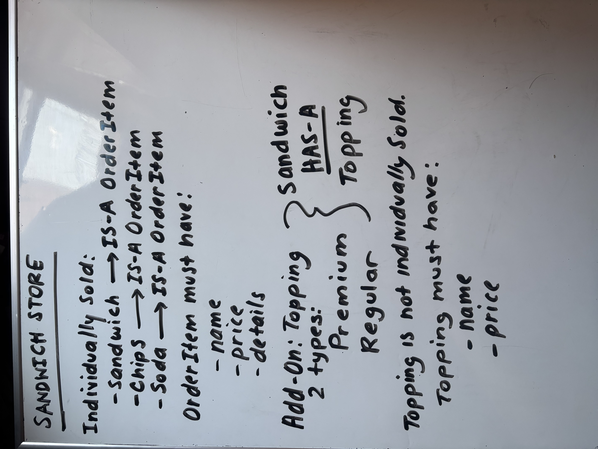
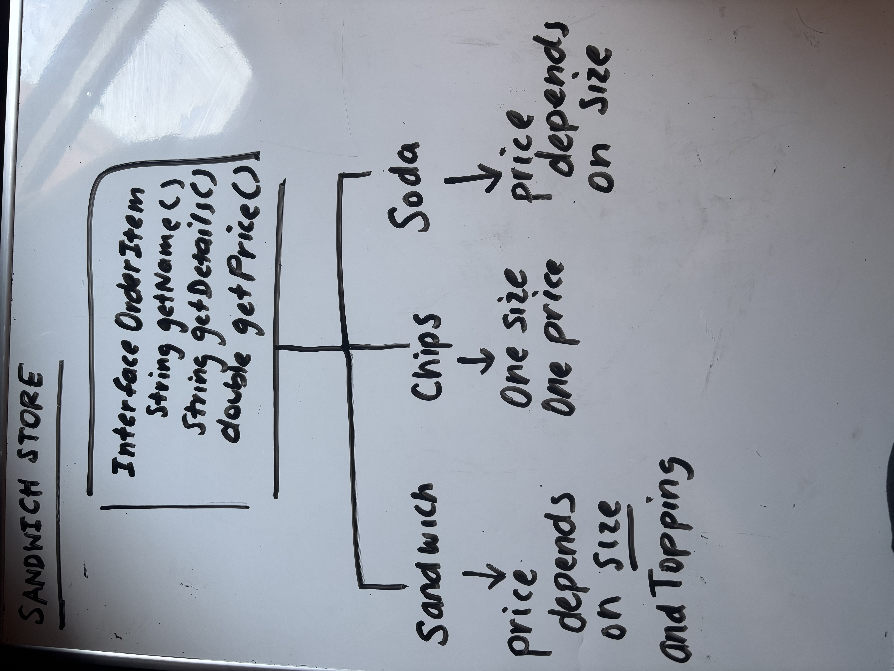
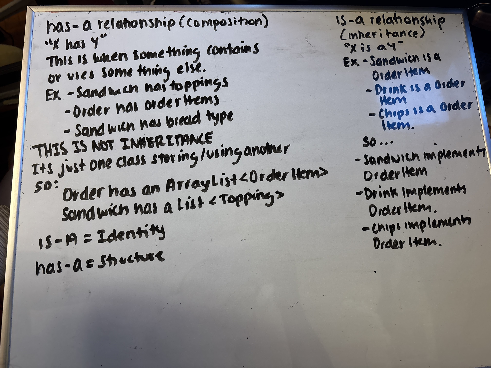
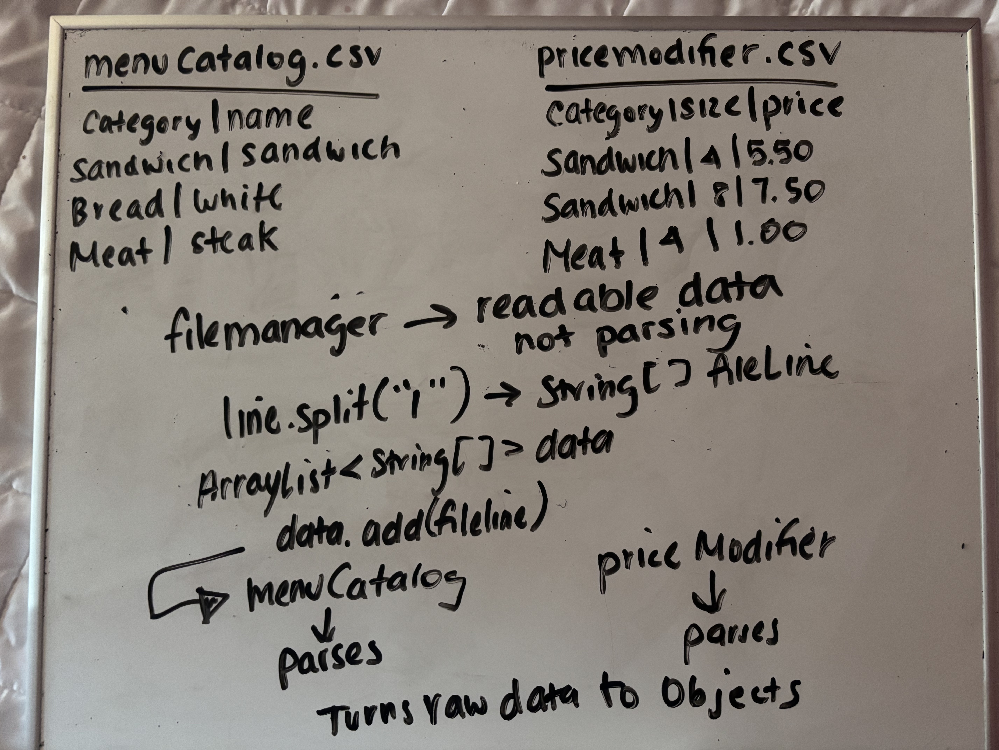

# Bread Winner Shop

## Description
Bread Winner Shop is a Java console-based application that allows
users to create custom sandwiches, order specialty sandwiches, 
add drinks and chips, edit their order, and generate receipts.
## Features
- Create custom sandwiches
- Select sandwich size, bread, toppings, sauces, and toasted options
- Order specialty sandwiches
- Add drinks and chips
- Edit existing order items
- Generate formatted receipts
- Save receipts to files
- Input validation for menu selections
## Technologies Used
- Java
- IntelliJ IDEA
## How to Run
1. Clone repository
2. Open the project in IntelliJ IDEA
3. Run the Main.java file
4. Follow the console prompts
## Project Structure
```text
Bread-Winner-Shop/
├── src/
│   ├── ui/
│   │   ├── Console.java
│   │   ├── OrderScreen.java
│   │   ├── ReceiptFormatter.java
│   │   ├── SandwichRequest.java
│   │   └── UserInterface.java
│   │
│   ├── business/
│   │   ├── Order.java
│   │   └── SandwichFactory.java
│   │
│   ├── models/
│   │   ├── Chips.java
│   │   ├── MenuItem.java
│   │   ├── OrderableItem.java
│   │   ├── Sandwich.java
│   │   ├── Soda.java
│   │   ├── Topping.java
│   │   └── enums/
│   │       ├── BreadType.java
│   │       ├── SandwichSize.java
│   │       ├── SodaSize.java
│   │       ├── SpecialitySandwich.java
│   │       └── ToppingCategory.java
│   │── Main
│   └── data/
│       └── ReceiptFileManager.java
├── data/
│   └── receipts/
├── whiteboard/
│   ├── classStructureIdea.jpeg
│   ├── flowChart1.jpeg
│   ├── initialPlans.jpeg
│   └── initialPlans2.jpeg
│
└── README.md
```
## Future Improvements
1. Persistent Order History
    - View previous receipts
    - search by date
2. Expand Menu System
   - Load menu from files instead of hardcoding into program.
## Initial Planning Sketch (Whiteboard Plan)









## Author
Janice Escobar-Hernandez